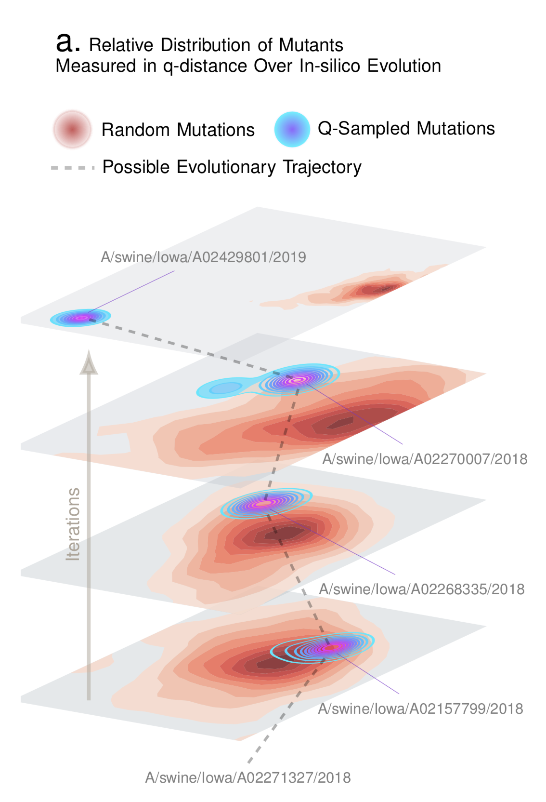

# Quasinet


<p align="center">
    
</p>


## Description

Infer non-local structural dependencies in genomic sequences. Genomic sequences are esentially compressed encodings of phenotypic information. This package provides a novel set of tools to extract long-range structural dependencies in genotypic data that define the phenotypic outcomes. The key capabilities implemented here are as follows: 

1. Compute the Quasinet (Q-net) given a database of nucleic acid sequences. The Q-net is a family of conditional inference trees that capture the predictability of each nucleotide position given the rest of the genome. The constructed Q-net for COVID-19 and Influenza A H1N1 HA 2008-9 is shown below.

COVID-19                   |  INFLUENZA
:-------------------------:|:-------------------------:
  | 


2. Compute a structure-aware evolution-adaptive notion of distance between genomes, which is demonstrably more biologically relevant compared to the standard edit distance. 

3. Draw samples in-silico that have a high probability of being biologically correct. For example, given a database of Influenza sequences, we can generate a new genomic sequence that has a high probability of being a valid influenza sequence.

<!-- { width=25% } -->

<p align="center">
    
</p>

## Installation

To install with pip:

```
pip install quasinet
```

To fix error in Mac:

```
from quasinet.macfix import macfix
macfix()
```


NOTE: If trying to reproduce the paper below, please use `pip install quasinet==0.0.58`

### Dependencies

* scikit-learn 
* scipy 
* numpy 
* numba 
* pandas 
* joblib 
* biopython

## Usage

```
from quasinet import qnet

# initialize qnet
myqnet = qnet.Qnet()

# train the qnet
myqnet.fit(X)

# compute qdistance
qdist = qnet.qdistance(seq1, seq2, myqnet, myqnet) 
```
 
### Examples

Examples are located [here](https://github.com/zeroknowledgediscovery/quasinet/tree/master/examples).

## Documentation

For more documentation, see [here](https://zeroknowledgediscovery.github.io/quasinet/build/html/index.html).

## Papers

For reference, please check out our paper: 

[Preparing For the Next Pandemic: Learning Wild Mutational Patterns At Scale For Analyzing Sequence Divergence In Novel Pathogens](https://www.medrxiv.org/content/10.1101/2020.07.17.20156364v3)

## Authors

You can reach the ZED lab at: zed.uchicago.edu
