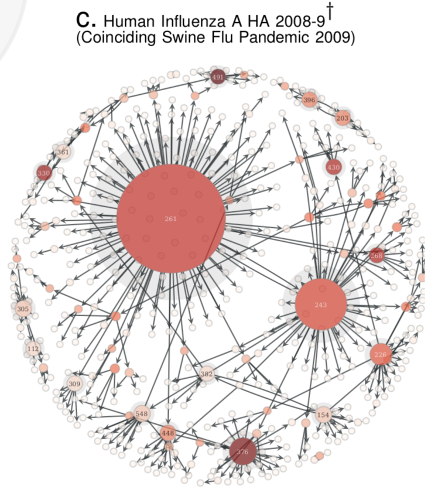

# Quasinet


<p align="center">
    
</p>


## Description

Infer non-local structural dependencies in genomic sequences. Genomic sequences are esentially compressed encodings of phenotypic information. This package provides a novel set of tools to extract long-range structural dependencies in genotypic data that define the phenotypic outcomes. The key capabilities implemented here are as follows: 

1. computing the q-net given a database of nucleic acid sequences, which is a family of conditional inference trees capturing the predictability of each nucleotide position given the rest of the genome. 

COVID-19                   |  INFLUENZA
:-------------------------:|:-------------------------:
  | 


2. Computing a structure-aware evolution-adaptive notion of distance between genomes, which demonstrably is much more biologically relevant compared to the standard edit distance 

3. Ability to draw samples in-silico, that have a high probability of being biologically correct. For example, given a database of HIV sequences, we can generate a new genomic sequence, which has a high probability of being a valid encoding of a HIV virion. The constructed q-net for long term non-progressor clinical phenotype in HIV-1 infection is shown below.

<!-- { width=25% } -->

<p align="center">
    
</p>

## Installation

To install with pip:

```
pip install quasinet
```

To install with conda:

```
conda install quasinet
```

### Dependencies

* scikit-learn 
* scipy 
* numpy 
* numba 
* pandas 
* joblib 
* biopython

## Usage

```
from quasinet import qnet

# initialize qnet
myqnet = qnet.Qnet()

# train the qnet
myqnet.fit(X)

# compute qdistance
qdist = qnet.qdistance(seq1, seq2, myqnet, myqnet) 
```
 
## Authors

You can read the ZED lab at: zed.uchicago.edu